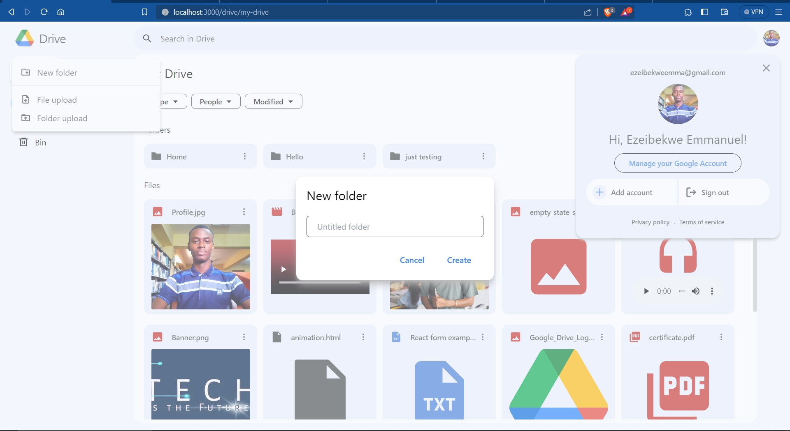
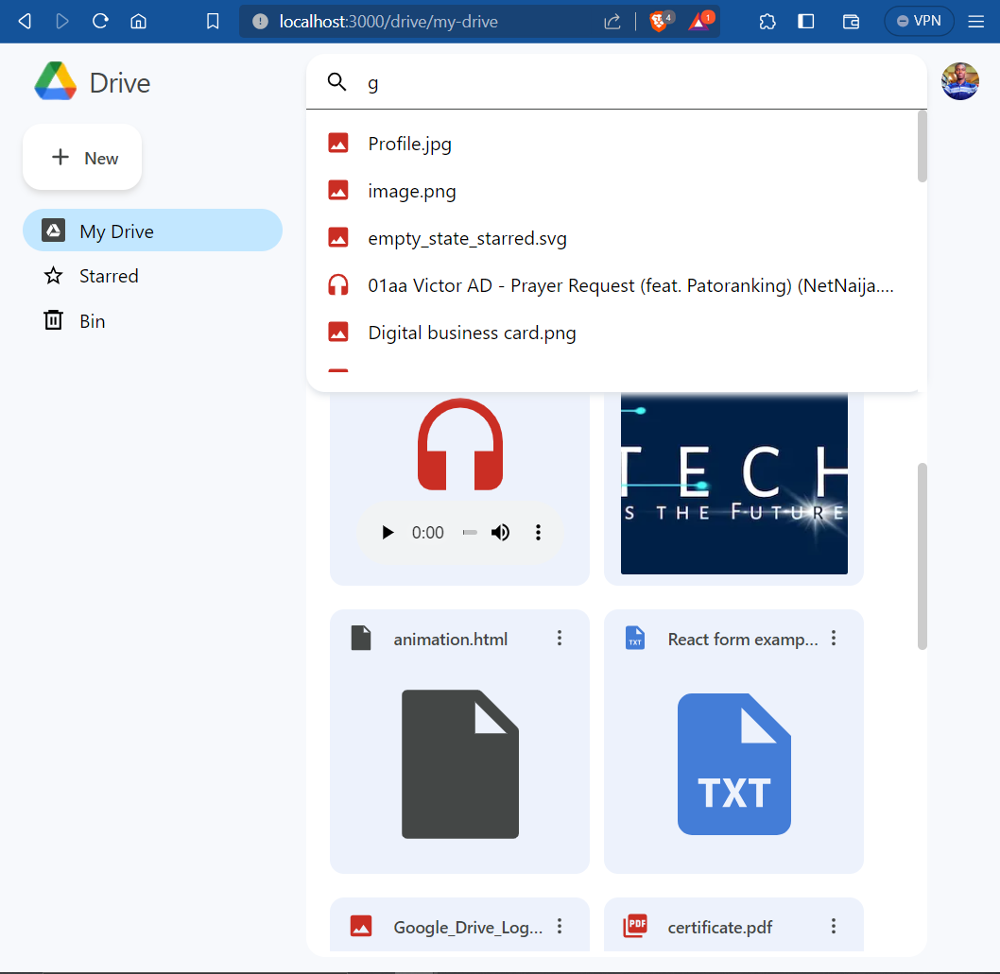

#  Google Drive Clone 

This project aims to replicate the core functionalities of [Google Drive](https://drive.google.com/drive/my-drive), providing users with cloud storage and efficient file management capabilities. It was built using modern web technologies and tools for a responsive and user-friendly experience.

### Demo

### Features

- **User Authentication**: The project employs NextAuth.js for user authentication, ensuring secure access to individual user accounts.

- **File Upload and Management**: Users can easily upload files and manage them, making it an ideal solution for storing documents, media files, and more.

- **Search Functionality**: The project includes a powerful search feature that allows users to find files and folders quickly based on their names.

- **Folder Navigation**: Users can organize their files into folders and navigate through their directory structure efficiently.

- **Responsive Design**: The user interface is designed to be responsive, adapting to various screen sizes and devices.

### Technology Stack

**Next.js** | **TypeScript** | **Tailwind CSS** | **React** | **Vercel** | **Firebase** | **NextAuth.js**

### How to Run

To run the project locally, follow these steps:

1. Clone the repository to your local machine.
2. Install the required dependencies using `npm install`.
3. Create a Firebase project and configure it for this application.
4. Set up authentication and real-time database in Firebase.
5. Configure the environment variables in `.env` checkout [.env.example](./.env.example)
6. Start the development server using `npm run dev`.

The application should now be running on your local environment. You can access it at [http://localhost:3000](http://localhost:3000).

### Issues and Feedback

If you encounter any issues with the application or have feedback to provide, please feel free to open an issue on the project's GitHub repository.

## Branches

- **dev** -> you can make your pull request to this branch
- **main** -> don't touch this branch this is the production branch

### Contributing

Contributions are welcome! Please open an issue or submit a pull request.

## Contribution Guidelines

1. Clone the repository and check out from `dev` branch.
2. Open your terminal & set the origin branch to `dev` if not set already.
3. Pull origin `git pull origin dev`
4. Create a new branch for the task you were assigned to, eg : `git checkout -b feat-csv-parser`
5. After making changes, do `git add .`
6. Commit your changes with a descriptive commit message : `git commit -m "your commit message"`.
7. To make sure there are no conflicts, run `git pull upstream dev`.
8. Push changes to your new branch, run `git push -u origin feat-csv-parser`.
9. Create a pull request to the `dev` branch not `main`.
10. Ensure to describe your pull request.

### License

MIT

### Acknowledgements

- Inspired by Google Drive.
- [Next.js Documentation](https://nextjs.org/docs/getting-started)
- [Firebase Documentation](https://firebase.google.com/docs)
- [NextAuth.js Documentation](https://next-auth.js.org/getting-started/introduction)
- [Tailwind CSS Documentation](https://tailwindcss.com/docs)
- [Vercel JS Documentation](https://vercel.com/docs)
