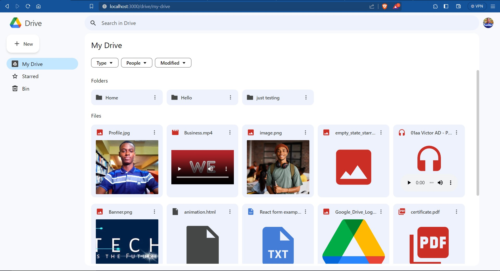
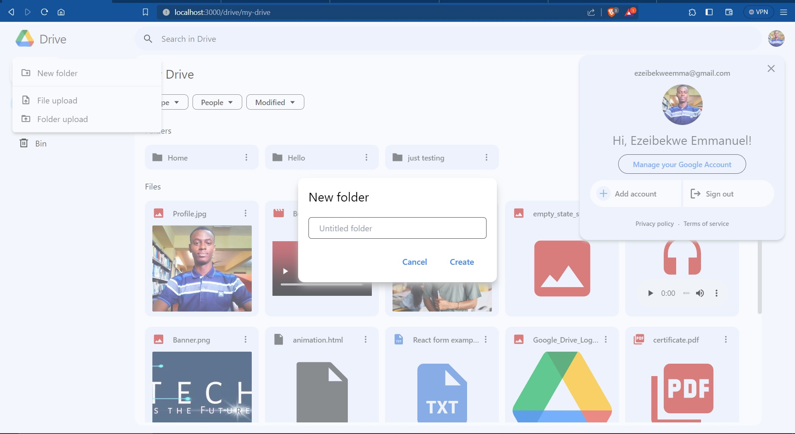
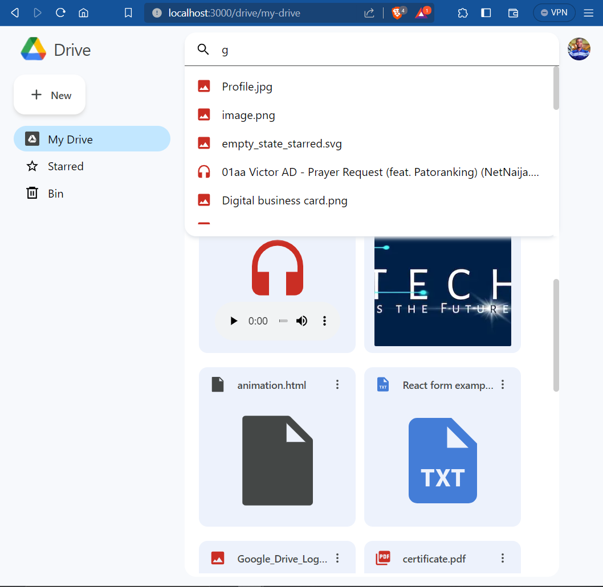
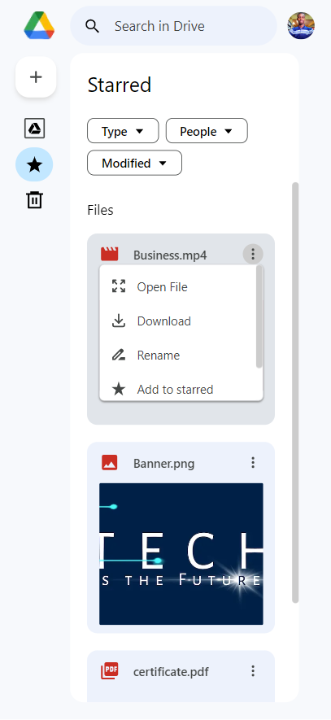

#  Google Drive Clone 

A Google Drive-inspired file manager built with Next.js, NextAuth, Firebase, Prisma, and Cloudinary.

### Demo






### Features

- Google sign-in with NextAuth
- File and folder creation, rename, move, copy, trash, and restore
- Cloudinary-backed file uploads and delivery
- Nested folders with breadcrumbs
- Folder upload support
- Storage usage tracking with a `200MB` per-user limit
- Starred items and trash views
- Public file sharing with `Only you` or `Anyone with the link`
- Responsive UI for desktop and mobile

### Tech Stack

**Next.js** | **TypeScript** | **React** | **Tailwind CSS** | **NextAuth.js** | **Prisma** | **Firebase** | **Cloudinary** | **Vercel** | **Google Cloud Platform**

## Local Setup

1. Clone the repository.
2. Install dependencies:

```bash
npm install
```

3. Copy `.env.example` to `.env`.
4. Fill in the required environment variables.
5. Push the Prisma schema:

```bash
npx prisma db push
```

6. Start the development server:

```bash
npm run dev
```

The app runs at [http://localhost:3000](http://localhost:3000).

## Environment Variables

Use [`.env.example`](./.env.example) as the template.

Required groups:

- `NEXTAUTH_SECRET`,
- `NEXTAUTH_URL`,
- `GOOGLE_CLIENT_ID`,
- `GOOGLE_CLIENT_SECRET`,
- `DATABASE_URL`
- `NEXT_PUBLIC_FIREBASE_API_KEY`
- `NEXT_PUBLIC_FIREBASE_AUTH_DOMAIN`
- `NEXT_PUBLIC_FIREBASE_PROJECT_ID`
- `NEXT_PUBLIC_FIREBASE_MESSAGING_SENDER_ID`
- `NEXT_PUBLIC_FIREBASE_APP_ID`
- `NEXT_PUBLIC_FIREBASE_MEASUREMENT_ID`
- `NEXT_PUBLIC_CLOUDINARY_CLOUD_NAME`
- `CLOUDINARY_API_KEY`
- `CLOUDINARY_API_SECRET`

## Architecture Notes

- Prisma + NextAuth handle user accounts and sessions.
- Firestore stores file and folder metadata.
- Cloudinary stores uploaded file assets.
- New uploads go to `google-drive-clone/{userId}/...` in Cloudinary.
- Public share links are backed by Firestore metadata and rendered through `/share/[token]`.

## Deployment Notes

Before deploying:

1. Set all environment variables in your hosting provider.
2. Use a production-ready `DATABASE_URL`. eg: PostgreSQL database instead of SQLite.
3. Run:

```bash
npx prisma db push
```

4. Verify your Google OAuth app includes the correct callback URL:
   `/api/auth/callback/google`
5. Make sure your Firebase Firestore project is created and reachable from the deployed app.
6. Make sure Cloudinary credentials are valid and server-side secrets are not exposed as `NEXT_PUBLIC_*`.

Build and start commands:

```bash
npm run build
npm run start
```

If deploying on Vercel, set the same environment variables there before the first build.

## Storage Notes

- The web app enforces a `200MB` limit per user, mainly for testing purposes.
- Firestore stores file size metadata used for quota checks.
- Older records created before file size tracking may need backfilling if quota accuracy matters.

## Sharing Notes

- Public sharing is currently file-based.
- Shared files can be opened through a public link.
- Shared links do not show the authenticated Drive layout.

## Contributing

1. Create a branch from `dev`.
2. Make your changes.
3. Test locally.
4. Open a pull request into `dev`.

## License

MIT License.

## Acknowledgements

- Inspired by Google Drive's core features and UI.
- Built with the help of Next.js, Firebase, Prisma, and Cloudinary documentation.
- This project is a personal learning exercise and is not affiliated with Google.
- If you find any issues or have suggestions, please open an issue or submit a pull request!
- Made with ❤️ by Ezeibekwe Emmanuel - [LinkedIn](https://www.linkedin.com/in/ezeibekweemma/)
- Happy coding and stay productive!
